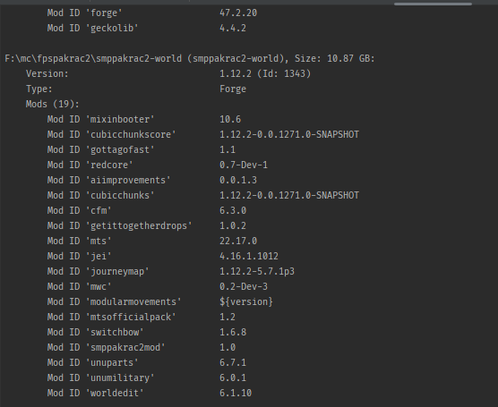

## About the project
The project was started on 12/3/2025.

This project prints out information about minecraft worlds (version, size, modded or not, what mods it uses...)\
To use it, run the program and put the path containing the minecraft world folders as the first argument.

